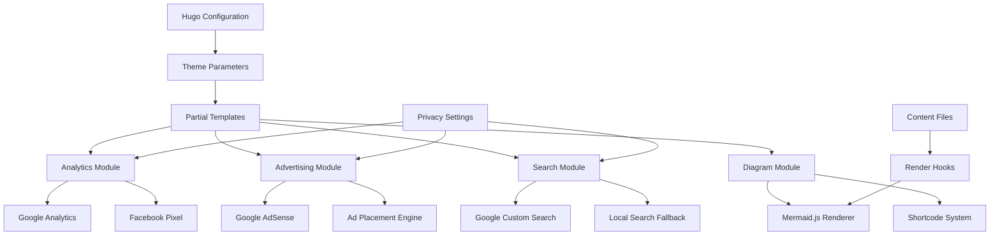

# Design Document

## Overview

This design document outlines the implementation of comprehensive analytics, advertising, search, and diagram capabilities for the Hugo theme. The enhancement integrates Google Analytics 4, Google AdSense, Google Custom Search Engine, Facebook Pixel, and Mermaid.js functionality while maintaining performance and privacy compliance.

The design follows Hugo's best practices for theme development, utilizing partial templates, configuration-driven features, and modular architecture to ensure maintainability and extensibility.

> **Implementation Note**: During implementation, developers should use Context7 MCP tools to reference the latest Hugo documentation and best practices. This ensures that all implementations align with current Hugo standards and utilize the most up-to-date APIs and configuration patterns.

## Architecture

### High-Level Architecture



### Module Dependencies

- **Analytics Module**: Depends on privacy configuration and consent management
- **Advertising Module**: Depends on analytics module for tracking and privacy settings
- **Search Module**: Independent with fallback capability
- **Diagram Module**: Independent with conditional loading

## Components and Interfaces

### 1. Configuration Interface

#### Hugo Configuration Schema
```toml
# Google Analytics Configuration
GoogleAnalyticsID = "G-JKSVCT23D1"

[params]
  # Google AdSense Configuration
  [params.adsense]
    enabled = true
    client = "ca-pub-2970874383549118"
    inArticleSlot = "4383549118"
    autoAds = true
    
    # Ad placement configuration
    [params.adsense.placements]
      header = true
      sidebar = true
      footer = true
      inContent = true
      
  # Facebook Pixel Configuration
  [params.facebookPixel]
    enabled = true
    pixelId = "YOUR_PIXEL_ID"
    
    # Event tracking configuration
    [params.facebookPixel.events]
      pageView = true
      viewContent = true
      search = true
      contact = true
      
  # Google Custom Search Configuration
  [params.gcs_engine_id]
    value = "3164aa570fbbb474a"
    
  # Mermaid Configuration
  [params.mermaid]
    enabled = true
    theme = "default"
    
  # Privacy and Performance Settings
  [params.privacy]
    respectDoNotTrack = true
    cookieConsent = true
    
  [params.performance]
    lazyLoadAds = true
    asyncScripts = true
```

### 2. Partial Template Architecture

#### Core Partials Structure
```
layouts/
├── partials/
│   ├── analytics/
│   │   ├── google-analytics.html
│   │   ├── facebook-pixel.html
│   │   └── analytics-manager.html
│   ├── advertising/
│   │   ├── adsense-head.html
│   │   ├── adsense-auto.html
│   │   ├── adsense-display.html
│   │   └── ad-manager.html
│   ├── search/
│   │   ├── google-custom-search.html
│   │   └── search-widget.html
│   └── diagrams/
│       ├── mermaid-loader.html
│       └── mermaid-init.html
├── _shortcodes/
│   └── mermaid.html
└── _render-hooks/
    └── render-codeblock-mermaid.html
```

### 3. Analytics Component Design

#### Google Analytics 4 Integration
```html
<!-- layouts/partials/analytics/google-analytics.html -->
{{- if site.Config.Services.GoogleAnalytics.ID -}}
{{- $respectDoNotTrack := site.Config.Privacy.GoogleAnalytics.RespectDoNotTrack -}}
<script async src="https://www.googletagmanager.com/gtag/js?id={{ site.Config.Services.GoogleAnalytics.ID }}"></script>
<script>
  var doNotTrack = false;
  {{- if $respectDoNotTrack -}}
  var dnt = (navigator.doNotTrack || window.doNotTrack || navigator.msDoNotTrack);
  var doNotTrack = (dnt == "1" || dnt == "yes");
  {{- end -}}
  
  if (!doNotTrack) {
    window.dataLayer = window.dataLayer || [];
    function gtag(){dataLayer.push(arguments);}
    gtag('js', new Date());
    gtag('config', '{{ site.Config.Services.GoogleAnalytics.ID }}', {
      'anonymize_ip': {{ site.Config.Privacy.GoogleAnalytics.AnonymizeIP | default true }},
      'respect_dnt': {{ $respectDoNotTrack }}
    });
  }
</script>
{{- end -}}
```

#### Facebook Pixel Integration
```html
<!-- layouts/partials/analytics/facebook-pixel.html -->
{{- $fbPixel := site.Params.facebookPixel -}}
{{- if and $fbPixel.enabled $fbPixel.pixelId -}}
<script>
  !function(f,b,e,v,n,t,s)
  {if(f.fbq)return;n=f.fbq=function(){n.callMethod?
  n.callMethod.apply(n,arguments):n.queue.push(arguments)};
  if(!f._fbq)f._fbq=n;n.push=n;n.loaded=!0;n.version='2.0';
  n.queue=[];t=b.createElement(e);t.async=!0;
  t.src=v;s=b.getElementsByTagName(e)[0];
  s.parentNode.insertBefore(t,s)}(window, document,'script',
  'https://connect.facebook.net/en_US/fbevents.js');
  
  fbq('init', '{{ $fbPixel.pixelId }}');
  {{- if $fbPixel.events.pageView -}}
  fbq('track', 'PageView');
  {{- end -}}
</script>
<noscript>
  
</noscript>
{{- end -}}
```

### 4. Advertising Component Design

#### AdSense Integration
```html
<!-- layouts/partials/advertising/adsense-head.html -->
{{- $adsense := site.Params.adsense -}}
{{- if and $adsense.enabled $adsense.client -}}
<script async src="https://pagead2.googlesyndication.com/pagead/js/adsbygoogle.js?client={{ $adsense.client }}"
        crossorigin="anonymous"></script>
{{- if $adsense.autoAds -}}
<script>
  (adsbygoogle = window.adsbygoogle || []).push({
    google_ad_client: "{{ $adsense.client }}",
    enable_page_level_ads: true
  });
</script>
{{- end -}}
{{- end -}}
```

#### Dynamic Ad Placement
```html
<!-- layouts/partials/advertising/adsense-display.html -->
{{- $adsense := site.Params.adsense -}}
{{- $slot := .slot -}}
{{- $format := .format | default "auto" -}}
{{- $responsive := .responsive | default true -}}

{{- if and $adsense.enabled $adsense.client $slot -}}
<div class="ad-container {{ .class | default "my-4" }}">
  <ins class="adsbygoogle"
       style="display:block"
       data-ad-client="{{ $adsense.client }}"
       data-ad-slot="{{ $slot }}"
       data-ad-format="{{ $format }}"
       {{- if $responsive }}data-full-width-responsive="true"{{ end }}></ins>
  <script>
    (adsbygoogle = window.adsbygoogle || []).push({});
  </script>
</div>
{{- end -}}
```

### 5. Search Component Design

#### Google Custom Search Integration
```html
<!-- layouts/partials/search/google-custom-search.html -->
{{- $gcsId := site.Params.gcs_engine_id.value -}}
{{- if $gcsId -}}
<div class="gcse-search" data-enableHistory="true" data-autoCompleteMaxCompletions="5"></div>
<script async src="https://cse.google.com/cse.js?cx={{ $gcsId }}"></script>
{{- else -}}
{{- partial "search/local-search.html" . -}}
{{- end -}}
```

### 6. Diagram Component Design

#### Mermaid.js Integration with Render Hooks
```html
<!-- layouts/_render-hooks/render-codeblock-mermaid.html -->
<div class="mermaid-container">
  <pre class="mermaid">{{ .Inner | htmlEscape | safeHTML }}</pre>
</div>
{{ .Page.Store.Set "hasMermaid" true }}
```

#### Mermaid Loader
```html
<!-- layouts/partials/diagrams/mermaid-loader.html -->
{{- if .Page.Store.Get "hasMermaid" -}}
{{- $mermaidConfig := site.Params.mermaid | default dict -}}
<script src="https://cdn.jsdelivr.net/npm/mermaid@10/dist/mermaid.min.js"></script>
<script>
  mermaid.initialize({
    theme: '{{ $mermaidConfig.theme | default "default" }}',
    startOnLoad: true,
    securityLevel: 'loose'
  });
</script>
{{- end -}}
```

#### Mermaid Shortcode
```html
<!-- layouts/_shortcodes/mermaid.html -->
<div class="mermaid-diagram">
  <pre class="mermaid">{{ .Inner | htmlEscape | safeHTML }}</pre>
</div>
{{ .Page.Store.Set "hasMermaid" true }}
```

## Data Models

### Configuration Data Structure
```go
type ThemeConfig struct {
    GoogleAnalyticsID string `toml:"GoogleAnalyticsID"`
    
    Params struct {
        AdSense struct {
            Enabled       bool   `toml:"enabled"`
            Client        string `toml:"client"`
            InArticleSlot string `toml:"inArticleSlot"`
            AutoAds       bool   `toml:"autoAds"`
            Placements    struct {
                Header    bool `toml:"header"`
                Sidebar   bool `toml:"sidebar"`
                Footer    bool `toml:"footer"`
                InContent bool `toml:"inContent"`
            } `toml:"placements"`
        } `toml:"adsense"`
        
        FacebookPixel struct {
            Enabled bool   `toml:"enabled"`
            PixelId string `toml:"pixelId"`
            Events  struct {
                PageView    bool `toml:"pageView"`
                ViewContent bool `toml:"viewContent"`
                Search      bool `toml:"search"`
                Contact     bool `toml:"contact"`
            } `toml:"events"`
        } `toml:"facebookPixel"`
        
        GCSEngineId struct {
            Value string `toml:"value"`
        } `toml:"gcs_engine_id"`
        
        Mermaid struct {
            Enabled bool   `toml:"enabled"`
            Theme   string `toml:"theme"`
        } `toml:"mermaid"`
        
        Privacy struct {
            RespectDoNotTrack bool `toml:"respectDoNotTrack"`
            CookieConsent     bool `toml:"cookieConsent"`
        } `toml:"privacy"`
        
        Performance struct {
            LazyLoadAds  bool `toml:"lazyLoadAds"`
            AsyncScripts bool `toml:"asyncScripts"`
        } `toml:"performance"`
    } `toml:"params"`
}
```

### Page Store Data
```go
type PageStore struct {
    HasMermaid    bool
    AdPlacements  []AdPlacement
    TrackingEvents []TrackingEvent
}

type AdPlacement struct {
    Position string
    Slot     string
    Format   string
    Class    string
}

type TrackingEvent struct {
    Service string
    Event   string
    Data    map[string]interface{}
}
```

## Error Handling

### Configuration Validation
- **Missing Required Fields**: Graceful degradation with warning messages
- **Invalid Configuration Values**: Default fallbacks with console warnings
- **Service Unavailability**: Timeout handling and fallback mechanisms

### Script Loading Failures
- **Network Issues**: Retry mechanisms with exponential backoff
- **Content Security Policy**: Clear error messages and configuration guidance
- **Third-party Service Outages**: Graceful degradation without breaking site functionality

### Privacy Compliance
- **Do Not Track Respect**: Automatic script disabling based on browser settings
- **GDPR Compliance**: Cookie consent integration with tracking services
- **Data Processing Transparency**: Clear documentation of data collection practices

## Testing Strategy

### Unit Testing
- **Configuration Parsing**: Validate TOML configuration parsing and defaults
- **Template Rendering**: Test partial template output with various configurations
- **Privacy Settings**: Verify Do Not Track and consent management functionality

### Integration Testing
- **Analytics Integration**: Verify Google Analytics and Facebook Pixel tracking
- **Ad Display**: Test AdSense ad rendering and placement
- **Search Functionality**: Validate Google Custom Search integration
- **Diagram Rendering**: Test Mermaid.js diagram generation

### Performance Testing
- **Script Loading**: Measure impact on page load times
- **Core Web Vitals**: Ensure acceptable performance metrics
- **Resource Optimization**: Validate lazy loading and async script behavior

### Cross-browser Testing
- **Modern Browsers**: Chrome, Firefox, Safari, Edge compatibility
- **Mobile Devices**: Responsive behavior and touch interactions
- **Legacy Support**: Graceful degradation for older browsers

### Privacy Compliance Testing
- **Do Not Track**: Verify tracking script disabling
- **Cookie Consent**: Test consent management integration
- **GDPR Compliance**: Validate data processing transparency

## Performance Considerations

### Script Loading Optimization
- **Async Loading**: All external scripts loaded asynchronously
- **Conditional Loading**: Mermaid.js only loaded when diagrams are present
- **Resource Hints**: Preconnect to external domains for faster loading

### Caching Strategy
- **Static Assets**: Long-term caching for theme assets
- **External Scripts**: CDN caching with fallback mechanisms
- **Configuration**: Build-time optimization for static configurations

### Lazy Loading Implementation
- **Below-the-fold Ads**: Intersection Observer API for ad loading
- **Diagram Rendering**: On-demand Mermaid initialization
- **Search Widget**: Progressive enhancement for search functionality

## Security Considerations

### Content Security Policy
- **Script Sources**: Whitelist trusted external domains
- **Inline Scripts**: Minimize inline JavaScript usage
- **Nonce Implementation**: Support for CSP nonce attributes

### Privacy Protection
- **Data Minimization**: Collect only necessary tracking data
- **Consent Management**: Respect user privacy preferences
- **Secure Transmission**: HTTPS-only external resource loading

### Input Validation
- **Configuration Sanitization**: Validate all user-provided configuration values
- **XSS Prevention**: Proper escaping of dynamic content
- **CSRF Protection**: Secure form handling for search and contact features