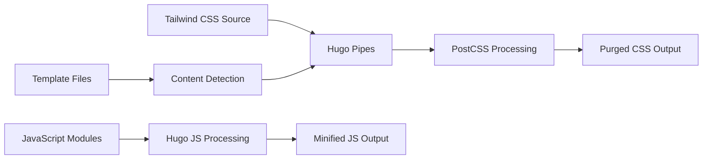

# Design Document

## Overview

This design document outlines the comprehensive redesign of the Parsa Hugo Theme, transforming it from a traditional Bootstrap-based layout to a modern, visually appealing design inspired by contemporary web standards. The redesign will leverage Tailwind CSS for styling, implement modern card-based layouts, gradient backgrounds, smooth animations, and maintain full Hugo functionality while providing an enhanced user experience.

The design follows a mobile-first approach with progressive enhancement, ensuring optimal performance across all devices. The visual language draws inspiration from the referenceSite's modern aesthetic while adapting it specifically for Hugo's templating system and static site generation capabilities.

## Architecture

### Technology Stack Migration

**Current Stack:**
- Bootstrap 4/5 for CSS framework
- jQuery for JavaScript interactions
- Traditional CSS with custom overrides
- Basic responsive design

**Target Stack:**
- Tailwind CSS 3.x with JIT compilation
- Vanilla JavaScript with modern ES6+ features
- CSS Grid and Flexbox for layouts
- CSS Custom Properties for theming
- Hugo Pipes for asset processing

### Build System Integration

The new design will integrate Tailwind CSS into Hugo's build pipeline using Hugo Pipes:



### File Structure Organization

Following Hugo official theme development standards:

```
parsa-redesigned/                    # Theme root directory
├── archetypes/
│   └── default.md                   # Default content archetype
├── assets/
│   ├── css/
│   │   ├── tailwind.css            # Tailwind CSS source
│   │   └── custom.css              # Custom theme styles
│   └── js/
│       ├── main.js                 # Main JavaScript functionality
│       ├── search.js               # Search implementation
│       └── theme-toggle.js         # Theme switching (if dark mode)
├── layouts/
│   ├── _default/
│   │   ├── baseof.html             # Base template (required)
│   │   ├── single.html             # Single page template
│   │   ├── list.html               # List page template
│   │   └── terms.html              # Taxonomy terms template
│   ├── _partials/                  # Partials directory (Hugo standard)
│   │   ├── head/
│   │   │   ├── meta.html           # Basic meta tags
│   │   │   ├── opengraph.html      # OpenGraph implementation
│   │   │   ├── twitter.html        # Twitter Cards
│   │   │   ├── styles.html         # CSS loading
│   │   │   └── scripts.html        # JavaScript loading
│   │   ├── header/
│   │   │   ├── navbar.html         # Main navigation
│   │   │   └── mobile-menu.html    # Mobile navigation
│   │   ├── content/
│   │   │   ├── hero.html           # Homepage hero section
│   │   │   ├── article-card.html   # Article card component
│   │   │   ├── featured-card.html  # Featured article card
│   │   │   └── category-filter.html # Category filtering
│   │   ├── footer/
│   │   │   ├── footer.html         # Site footer
│   │   │   └── social-share.html   # Social sharing buttons
│   │   └── widgets/
│   │       ├── search.html         # Search widget
│   │       ├── tags-cloud.html     # Tag cloud widget
│   │       └── related.html        # Related articles
│   ├── _shortcodes/                # Shortcodes directory (Hugo standard)
│   │   ├── figure.html             # Enhanced figure shortcode
│   │   ├── youtube.html            # YouTube embed
│   │   └── gallery.html            # Image gallery shortcode
│   ├── homepage/
│   │   └── homepage.html           # Custom homepage layout
│   ├── partials/                   # Alternative partials location
│   └── index.html                  # Homepage template
├── static/
│   ├── images/
│   │   ├── og-default.jpg          # Default OpenGraph image
│   │   ├── favicon.ico             # Site favicon
│   │   └── logo.svg                # Theme logo
│   ├── robots.txt                  # SEO robots file
│   └── admin/                      # CMS admin (if needed)
├── data/
│   ├── social.yaml                 # Social media links
│   └── theme.yaml                  # Theme configuration data
├── i18n/
│   ├── en.yaml                     # English translations
│   ├── zh.yaml                     # Chinese translations
│   └── zh-tw.yaml                  # Traditional Chinese
├── exampleSite/                    # Required example site
│   ├── config/
│   │   └── _default/
│   │       └── hugo.toml           # Example configuration
│   ├── content/
│   │   ├── _index.md               # Homepage content
│   │   ├── about.md                # About page
│   │   └── posts/                  # Example posts
│   └── static/
│       └── images/                 # Example images
├── hugo.toml                       # Theme-level Hugo config
├── theme.toml                      # Theme metadata (required)
├── LICENSE                         # Theme license (required)
├── README.md                       # Theme documentation (required)
└── CHANGELOG.md                    # Version history
```

## Components and Interfaces

### OpenGraph and Social Sharing Implementation

**OpenGraph Meta Tags Partial (`layouts/partials/head/opengraph.html`):**
```html
{{ if .Site.Params.enableOpenGraph }}
<!-- OpenGraph Meta Tags -->
<meta property="og:title" content="{{ with .Params.og.title }}{{ . }}{{ else }}{{ .Title }}{{ end }}" />
<meta property="og:description" content="{{ with .Params.og.description }}{{ . }}{{ else }}{{ with .Description }}{{ . }}{{ else }}{{ .Site.Params.description }}{{ end }}{{ end }}" />
<meta property="og:type" content="{{ if .IsPage }}article{{ else }}website{{ end }}" />
<meta property="og:url" content="{{ .Permalink }}" />
<meta property="og:site_name" content="{{ .Site.Params.openGraph.siteName | default .Site.Title }}" />

{{ with .Params.image | default .Site.Params.openGraph.defaultImage }}
<meta property="og:image" content="{{ . | absURL }}" />
{{ end }}

{{ if .IsPage }}
<meta property="article:published_time" content="{{ .Date.Format "2006-01-02T15:04:05Z07:00" }}" />
{{ with .Lastmod }}<meta property="article:modified_time" content="{{ .Format "2006-01-02T15:04:05Z07:00" }}" />{{ end }}
{{ with .Params.author }}<meta property="article:author" content="{{ . }}" />{{ end }}
{{ range .Params.categories }}<meta property="article:section" content="{{ . }}" />{{ end }}
{{ range .Params.tags }}<meta property="article:tag" content="{{ . }}" />{{ end }}
{{ end }}

{{ with .Site.Params.openGraph.facebookAppId }}
<meta property="fb:app_id" content="{{ . }}" />
{{ end }}
{{ end }}
```

**Twitter Card Meta Tags Partial (`layouts/partials/head/twitter.html`):**
```html
{{ if .Site.Params.enableTwitterCard }}
<!-- Twitter Card Meta Tags -->
<meta name="twitter:card" content="{{ .Params.twitter.card | default "summary_large_image" }}" />
{{ with .Site.Params.openGraph.twitterSite }}<meta name="twitter:site" content="{{ . }}" />{{ end }}
<meta name="twitter:title" content="{{ with .Params.twitter.title }}{{ . }}{{ else }}{{ .Title }}{{ end }}" />
<meta name="twitter:description" content="{{ with .Params.twitter.description }}{{ . }}{{ else }}{{ with .Description }}{{ . }}{{ else }}{{ .Site.Params.description }}{{ end }}{{ end }}" />

{{ with .Params.twitter.image | default .Params.image | default .Site.Params.openGraph.defaultImage }}
<meta name="twitter:image" content="{{ . | absURL }}" />
{{ end }}

{{ with .Params.imageAlt }}
<meta name="twitter:image:alt" content="{{ . }}" />
{{ end }}
{{ end }}
```

**Social Sharing Buttons Partial (`layouts/partials/footer/social-share.html`):**
```html
{{ if .Site.Params.enableSocialSharing }}
<div class="social-share flex items-center space-x-4 mt-6 pt-6 border-t">
  <span class="text-sm font-medium text-muted-foreground">分享文章：</span>
  
  <a href="https://twitter.com/intent/tweet?url={{ .Permalink | urlquery }}&text={{ .Title | urlquery }}" 
     target="_blank" rel="noopener"
     class="inline-flex items-center px-3 py-2 text-sm bg-blue-500 text-white rounded-md hover:bg-blue-600 transition-colors">
    <svg class="w-4 h-4 mr-2" fill="currentColor" viewBox="0 0 24 24">
      <!-- Twitter icon SVG -->
    </svg>
    Twitter
  </a>
  
  <a href="https://www.facebook.com/sharer/sharer.php?u={{ .Permalink | urlquery }}" 
     target="_blank" rel="noopener"
     class="inline-flex items-center px-3 py-2 text-sm bg-blue-600 text-white rounded-md hover:bg-blue-700 transition-colors">
    <svg class="w-4 h-4 mr-2" fill="currentColor" viewBox="0 0 24 24">
      <!-- Facebook icon SVG -->
    </svg>
    Facebook
  </a>
  
  <a href="https://www.linkedin.com/sharing/share-offsite/?url={{ .Permalink | urlquery }}" 
     target="_blank" rel="noopener"
     class="inline-flex items-center px-3 py-2 text-sm bg-blue-700 text-white rounded-md hover:bg-blue-800 transition-colors">
    <svg class="w-4 h-4 mr-2" fill="currentColor" viewBox="0 0 24 24">
      <!-- LinkedIn icon SVG -->
    </svg>
    LinkedIn
  </a>
  
  <button onclick="copyToClipboard('{{ .Permalink }}')"
          class="inline-flex items-center px-3 py-2 text-sm bg-gray-500 text-white rounded-md hover:bg-gray-600 transition-colors">
    <svg class="w-4 h-4 mr-2" fill="currentColor" viewBox="0 0 24 24">
      <!-- Copy icon SVG -->
    </svg>
    複製連結
  </button>
</div>
{{ end }}
```

### Hugo Theme Development Standards Compliance

**Theme Configuration (`theme.toml`) - Following Hugo Standards:**
```toml
# Required theme metadata following Hugo theme standards
name = "Parsa Redesigned"
license = "MIT"
licenselink = "https://github.com/username/parsa-redesigned/blob/main/LICENSE"
description = "A modern, redesigned version of the Parsa Hugo theme with Tailwind CSS and contemporary design elements"
homepage = "https://github.com/username/parsa-redesigned"
demosite = "https://parsa-redesigned-demo.netlify.app"

# Theme tags for discoverability
tags = [
  "blog", "personal", "modern", "tailwind", "responsive", 
  "multilingual", "seo", "fast", "minimal", "cards", "gradient"
]

# Theme features
features = [
  "responsive", "tailwind-css", "multilingual", 
  "seo-optimized", "social-sharing", "search", "performance"
]

# Hugo version requirements
min_version = "0.147.2"

# Author information
[author]
  name = "Your Name"
  homepage = "https://yourwebsite.com"
  email = "your.email@example.com"

# Original theme attribution (if forking/redesigning)
[original]
  name = "Parsa Hugo"
  homepage = "https://gethugothemes.com/products/parsa-hugo-theme/"
  repo = "https://github.com/themefisher/parsa-hugo"
```

**Hugo Module Configuration (hugo.toml in theme root):**
```toml
# Theme-level configuration for Hugo Modules support
[module]
  [module.hugoVersion]
    extended = true
    min = "0.147.2"
    max = ""
  
  # Theme dependencies (if any)
  [[module.imports]]
    path = "github.com/gohugoio/hugo-mod-bootstrap-scss/v5"
    disable = false
  
  # Mount points for theme assets
  [[module.mounts]]
    source = "assets"
    target = "assets"
  
  [[module.mounts]]
    source = "layouts"
    target = "layouts"
  
  [[module.mounts]]
    source = "static"
    target = "static"
```

## Components and Interfaces

### 1. Header Component

**Design Specifications:**
- Sticky navigation with backdrop blur effect
- Logo with gradient text treatment
- Horizontal navigation for desktop, hamburger menu for mobile
- Search icon with smooth transition to search page
- Active state indicators with subtle animations

**Technical Implementation:**
- Uses CSS `position: sticky` with `backdrop-filter: blur()`
- Responsive breakpoints at 768px (md) and 1024px (lg)
- Mobile menu with slide-in animation using CSS transforms
- Logo implemented as SVG or CSS gradient text

### 2. Hero Section

**Design Specifications:**
- Full-width gradient background (primary to accent colors)
- Centered content with animated fade-in effects
- Featured badge with icon and text
- Large typography with gradient text treatment
- Responsive typography scaling

**Visual Elements:**
- Background: `bg-gradient-to-br from-primary/10 via-accent/5 to-background`
- Typography: 5xl on desktop, 4xl on tablet, 3xl on mobile
- Animation: Staggered fade-in with CSS animations

### 3. Article Card Component

**Standard Card Design:**
- Aspect ratio maintained image container (16:9)
- Overlay category badge on image
- Card content with title, excerpt, and metadata
- Hover effects with subtle lift and shadow increase
- Author, read time, and date information

**Featured Card Design:**
- Larger format with overlay text on image
- Gradient overlay for text readability
- Enhanced typography hierarchy
- More prominent hover effects

**Technical Specifications:**
```html
<!-- Standard Card Structure -->
<article class="group overflow-hidden rounded-lg border bg-card hover:shadow-lg transition-all duration-300 hover:-translate-y-1">
  <div class="relative aspect-video overflow-hidden">
    
    <span class="absolute top-3 left-3 badge">Category</span>
  </div>
  <div class="p-5">
    <h3 class="font-semibold mb-2 line-clamp-2 group-hover:text-primary transition-colors">Title</h3>
    <p class="text-muted-foreground text-sm mb-4 line-clamp-2">Excerpt</p>
    <div class="flex items-center justify-between text-xs text-muted-foreground">
      <div class="flex items-center space-x-3">
        <span>Author</span>
        <span>Read Time</span>
      </div>
      <ArrowRight class="h-4 w-4 group-hover:translate-x-1 transition-transform" />
    </div>
  </div>
</article>
```

### 4. Navigation System

**Desktop Navigation:**
- Horizontal menu with hover states
- Active page highlighting
- Smooth transitions between states
- Search icon integration

**Mobile Navigation:**
- Hamburger menu icon with animated transformation
- Slide-out menu panel with backdrop
- Touch-friendly navigation items
- Search integration in mobile menu

### 5. Search Interface

**Search Page Design:**
- Prominent search input with modern styling
- Real-time search suggestions (if implemented)
- Results displayed in consistent card format
- Empty state with helpful messaging
- Search term highlighting in results

### 6. Tags Cloud

**Visual Design:**
- Variable font sizes based on tag frequency
- Interactive hover effects
- Responsive grid layout
- Color variations for visual interest
- Smooth transitions on interaction

## Data Models

### Article Data Structure

The design will work with Hugo's existing content structure while enhancing the presentation:

```yaml
# Front Matter Structure
---
title: "Article Title"
date: 2025-10-12T10:00:00Z
author: "Author Name"
categories: ["category-slug"]
tags: ["tag1", "tag2", "tag3"]
featured: true/false
image: "path/to/image.jpg"
excerpt: "Article excerpt for cards"
readTime: 5
---
```

### Site Configuration

Enhanced site configuration following Hugo theme development standards:

```yaml
# hugo.toml - Main configuration
baseURL = "https://example.com"
languageCode = "en-us"
title = "Site Title"
theme = "parsa-redesigned"

# Hugo theme requirements
[module]
  [module.hugoVersion]
    extended = true
    min = "0.147.2"

[params]
  # Design settings
  primaryColor = "#3b82f6"
  accentColor = "#8b5cf6"
  
  # Feature toggles
  enableSearch = true
  enableTagCloud = true
  enableAnimations = true
  enableDarkMode = false
  
  # Layout settings
  articlesPerPage = 9
  featuredArticlesCount = 2
  
  # Social and SEO
  enableSocialSharing = true
  enableOpenGraph = true
  enableTwitterCard = true
  
  # OpenGraph default settings
  [params.openGraph]
    siteName = "Site Name"
    defaultImage = "/images/og-default.jpg"
    twitterSite = "@username"
    facebookAppId = ""
  
  # Author information
  [params.author]
    name = "Default Author"
    image = "/images/author.jpg"
    bio = "Author bio"
    social = [
      {name = "twitter", url = "https://twitter.com/username"},
      {name = "github", url = "https://github.com/username"}
    ]

# Taxonomy configuration
[taxonomies]
  category = "categories"
  tag = "tags"
  author = "authors"

# Menu configuration
[menu]
  [[menu.main]]
    name = "Home"
    url = "/"
    weight = 1
  [[menu.main]]
    name = "Categories"
    url = "/categories/"
    weight = 2
  [[menu.main]]
    name = "Tags"
    url = "/tags/"
    weight = 3

# Output formats for search
[outputs]
  home = ["HTML", "RSS", "JSON"]
  section = ["HTML", "RSS"]

# Markup configuration
[markup]
  [markup.goldmark]
    [markup.goldmark.renderer]
      unsafe = true
  [markup.highlight]
    style = "github"
    lineNos = true
```

### OpenGraph and Social Sharing Configuration

Enhanced front matter structure for optimal social sharing:

```yaml
# Enhanced Front Matter for Articles
---
title: "Article Title"
date: 2025-10-12T10:00:00Z
lastmod: 2025-10-12T10:00:00Z
author: "Author Name"
categories: ["category-slug"]
tags: ["tag1", "tag2", "tag3"]
featured: true
draft: false

# SEO and Social
description: "Article description for SEO and social sharing"
excerpt: "Shorter excerpt for article cards"
image: "images/article-image.jpg"
imageAlt: "Descriptive alt text for the image"

# OpenGraph specific
og:
  title: "Custom OG Title (optional)"
  description: "Custom OG description (optional)"
  image: "images/og-specific-image.jpg"
  type: "article"

# Twitter Card specific
twitter:
  card: "summary_large_image"
  title: "Custom Twitter title (optional)"
  description: "Custom Twitter description (optional)"
  image: "images/twitter-card-image.jpg"

# Article specific
readTime: 5
wordCount: 1200
---
```

## Error Handling

### Graceful Degradation

**JavaScript Disabled:**
- All core functionality remains accessible
- Navigation works without JavaScript
- Search falls back to Hugo's built-in search
- Animations gracefully degrade to static states

**Image Loading Failures:**
- Placeholder images with consistent aspect ratios
- Alt text displayed for accessibility
- Lazy loading with intersection observer
- Progressive image enhancement

**Content Missing:**
- Empty state designs for no articles
- Fallback content for missing excerpts
- Default author information
- Graceful handling of missing metadata

### Performance Considerations

**CSS Optimization:**
- Tailwind CSS purging removes unused styles
- Critical CSS inlined for above-the-fold content
- Non-critical CSS loaded asynchronously
- CSS custom properties for theme consistency

**JavaScript Optimization:**
- Minimal JavaScript footprint
- Progressive enhancement approach
- Lazy loading for non-critical features
- Modern ES6+ with fallbacks

**Image Optimization:**
- Responsive images with srcset
- WebP format with fallbacks
- Lazy loading implementation
- Proper aspect ratio maintenance

## Testing Strategy

### Visual Regression Testing

**Cross-Browser Compatibility:**
- Chrome, Firefox, Safari, Edge testing
- Mobile browser testing (iOS Safari, Chrome Mobile)
- Progressive enhancement verification
- Accessibility testing with screen readers

**Responsive Design Testing:**
- Breakpoint testing at 320px, 768px, 1024px, 1440px
- Orientation change handling
- Touch interaction testing
- Print stylesheet verification

### Performance Testing

**Core Web Vitals:**
- Largest Contentful Paint (LCP) < 2.5s
- First Input Delay (FID) < 100ms
- Cumulative Layout Shift (CLS) < 0.1
- First Contentful Paint (FCP) < 1.8s

**Lighthouse Audits:**
- Performance score > 90
- Accessibility score > 95
- Best Practices score > 90
- SEO score > 95

### Functional Testing

**Hugo Integration:**
- Template rendering verification
- Content type handling
- Taxonomy functionality
- Multilingual support (i18n)
- Build process validation
- OpenGraph meta tag generation
- Social sharing functionality
- Theme configuration compatibility
- Hugo Modules support
- Shortcode functionality

**User Experience Testing:**
- Navigation flow testing
- Search functionality
- Mobile usability
- Form interactions
- Loading state handling

### Accessibility Testing

**WCAG 2.1 AA Compliance:**
- Color contrast ratios > 4.5:1
- Keyboard navigation support
- Screen reader compatibility
- Focus management
- Alternative text for images

**Semantic HTML:**
- Proper heading hierarchy
- Landmark regions
- Form labeling
- Link descriptions
- Button accessibility

## Migration Strategy

### Phase 1: Foundation Setup
- Tailwind CSS integration with Hugo Pipes
- Base template structure creation
- Core partial templates development
- Basic responsive grid system

### Phase 2: Component Development
- Header and navigation components
- Article card components (standard and featured)
- Footer and widget components
- Search interface implementation

### Phase 3: Page Templates
- Homepage template with hero section
- Article single page template
- Category and tag listing templates
- Search results page template

### Phase 4: Enhancement and Optimization
- Animation and transition implementation
- Performance optimization
- Accessibility improvements
- Cross-browser testing and fixes

### Phase 5: Testing and Deployment
- Comprehensive testing across devices
- Performance auditing
- Documentation creation
- Migration guide development

This design provides a comprehensive foundation for transforming the Parsa Hugo Theme into a modern, visually appealing, and highly functional website that meets contemporary web standards while maintaining Hugo's powerful static site generation capabilities.
## Hugo Theme Development Standards Compliance

### Official Hugo Theme Requirements

Based on Hugo's official documentation and theme development standards:

**Mandatory Files (Hugo Requirements):**
- `theme.toml` - Theme metadata with required fields (name, license, description, min_version)
- `LICENSE` - Open source license file
- `README.md` - Comprehensive theme documentation with installation and usage
- `exampleSite/` - Complete working example site for demonstration and testing

**Standard Directory Structure (Hugo Convention):**
- `layouts/_default/baseof.html` - Base template (required for all themes)
- `layouts/_partials/` - Reusable template components
- `layouts/_shortcodes/` - Custom shortcode templates
- `archetypes/default.md` - Default content template
- `assets/` - Source files for Hugo Pipes processing
- `static/` - Static files copied directly to output
- `i18n/` - Internationalization translation files

### Hugo Template Standards

**Template Hierarchy Compliance:**
- Follow Hugo's template lookup order
- Use proper template inheritance with `baseof.html`
- Implement content views for different display formats
- Support all Hugo content types (page, section, taxonomy, term)

**Hugo Features Integration:**
- Support Hugo's built-in taxonomies (categories, tags)
- Implement Hugo menus configuration
- Use Hugo's image processing capabilities
- Support Hugo Modules architecture
- Implement proper pagination

### Configuration Standards

**Theme Parameters (Hugo Best Practices):**
```toml
# Standard Hugo configuration structure
[params]
  # Theme-specific parameters with clear naming
  [params.theme]
    primaryColor = "#3b82f6"
    accentColor = "#8b5cf6"
  
  # Feature toggles
  [params.features]
    search = true
    darkMode = false
    socialSharing = true
  
  # SEO and social
  [params.seo]
    enableOpenGraph = true
    enableTwitterCard = true
    defaultImage = "/images/og-default.jpg"
```

**Content Structure Support:**
- Standard Hugo front matter fields
- Custom front matter for theme features
- Graceful handling of missing fields
- Support for content bundles and page resources

### Performance Standards (Hugo Optimization)

**Hugo Pipes Integration:**
- CSS processing with PostCSS and Tailwind
- JavaScript bundling and minification
- Image processing and optimization
- Asset fingerprinting for cache busting

**Build Optimization:**
```toml
# Hugo build configuration for performance
[build]
  writeStats = true
  
[caches]
  [caches.getjson]
    maxAge = "10m"
  [caches.getcsv]
    maxAge = "10m"
  [caches.images]
    maxAge = "1h"
```

### SEO and Social Standards (Hugo Implementation)

**Built-in Hugo SEO Features:**
- Use Hugo's internal OpenGraph template as base
- Implement Twitter Card templates
- Support Hugo's sitemap generation
- Use Hugo's robots.txt template
- Implement structured data with Hugo templates

**Social Sharing Integration:**
```html
<!-- Using Hugo's built-in social sharing -->
{{ template "_internal/opengraph.html" . }}
{{ template "_internal/twitter_cards.html" . }}
{{ template "_internal/schema.html" . }}
```

### Accessibility Standards (Hugo Best Practices)

**Semantic HTML with Hugo:**
- Use Hugo's semantic HTML generation
- Implement proper heading hierarchy with `.TableOfContents`
- Support Hugo's figure shortcode with alt text
- Use Hugo's menu system for accessible navigation

### Internationalization (Hugo i18n)

**Hugo i18n Implementation:**
```yaml
# i18n/en.yaml
- id: readMore
  translation: "Read More"
- id: categories
  translation: "Categories"
- id: tags
  translation: "Tags"

# i18n/zh.yaml
- id: readMore
  translation: "閱讀更多"
- id: categories
  translation: "分類"
- id: tags
  translation: "標籤"
```

**Multilingual Support:**
- Use Hugo's multilingual configuration
- Support content translation with Hugo's language system
- Implement language switching with Hugo's language functions
- Handle RTL languages with Hugo's language direction

### Theme Testing Standards

**Hugo Theme Testing:**
- Test with Hugo's example site structure
- Verify template lookup order functionality
- Test with different Hugo versions (min_version compliance)
- Validate HTML output with Hugo's built-in validation
- Test build performance with Hugo's build stats

This design ensures complete compliance with Hugo's official theme development standards, leveraging Hugo's built-in features and following established conventions for maximum compatibility and maintainability.