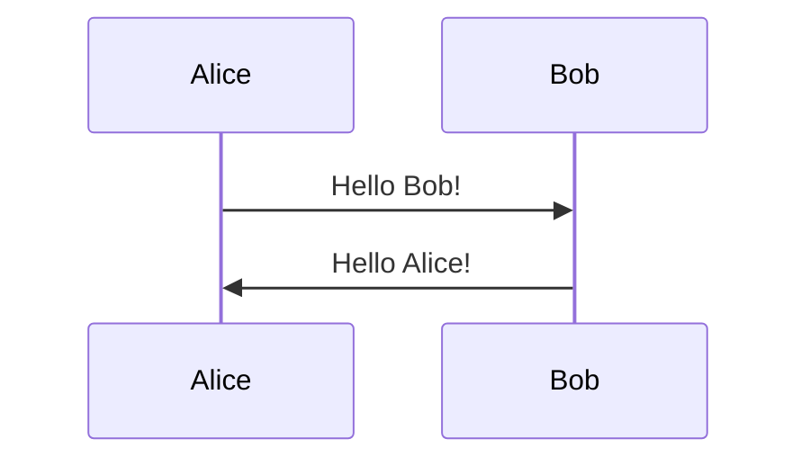

# Hugo Shortcodes Documentation

This theme provides enhanced versions of Hugo's built-in shortcodes along with custom shortcodes for rich content creation. All shortcodes are designed with privacy, performance, and accessibility in mind.

## Table of Contents

- [Video Shortcodes](#video-shortcodes)
  - [YouTube](#youtube)
  - [Vimeo](#vimeo)
- [Social Media Shortcodes](#social-media-shortcodes)
  - [Twitter](#twitter)
  - [Instagram](#instagram)
- [Code Shortcodes](#code-shortcodes)
  - [GitHub Gist](#github-gist)
- [Content Shortcodes](#content-shortcodes)
  - [Figure](#figure)
  - [Alert](#alert)
  - [Mermaid Diagrams](#mermaid-diagrams)
- [Privacy Settings](#privacy-settings)
- [Troubleshooting](#troubleshooting)

## Video Shortcodes

### YouTube

Embed YouTube videos with privacy-enhanced mode and customization options.

#### Basic Usage

```markdown

```

#### Advanced Usage

```markdown

```

#### Parameters

| Parameter | Required | Default | Description |
|-----------|----------|---------|-------------|
| `id` | Yes | - | YouTube video ID |
| `title` | No | "YouTube video" | Video title for accessibility |
| `autoplay` | No | "false" | Enable autoplay ("true" or "false") |
| `start` | No | - | Start time in seconds |
| `class` | No | - | Additional CSS classes |
| `privacy` | No | "true" | Use privacy-enhanced mode |

#### Privacy Features

- Uses `youtube-nocookie.com` domain by default for enhanced privacy
- Respects Hugo's privacy configuration
- Includes structured data for SEO
- Loading placeholder with smooth transitions

### Vimeo

Embed Vimeo videos with Do Not Track support.

#### Basic Usage

```markdown

```

#### Advanced Usage

```markdown

```

#### Parameters

| Parameter | Required | Default | Description |
|-----------|----------|---------|-------------|
| `id` | Yes | - | Vimeo video ID |
| `title` | No | "Vimeo video" | Video title for accessibility |
| `autoplay` | No | "false" | Enable autoplay ("true" or "false") |
| `class` | No | - | Additional CSS classes |

#### Privacy Features

- Enables Do Not Track (DNT) by default
- Removes branding and user information
- Respects Hugo's privacy configuration

## Social Media Shortcodes

### Twitter

Embed Twitter posts with privacy options and fallback modes.

#### Basic Usage

```markdown

```

#### Parameters

| Parameter | Required | Default | Description |
|-----------|----------|---------|-------------|
| `user` | No | - | Twitter username (for URL generation) |
| `id` | Yes | - | Tweet ID |
| `class` | No | - | Additional CSS classes |

#### Privacy Features

- Respects `privacy.twitter.simple` configuration
- In simple mode, shows a styled link instead of full embed
- Enables Do Not Track when configured
- Graceful fallback for blocked content

#### Simple Mode

When `privacy.twitter.simple = true` in your Hugo config:

```toml
[privacy]
  [privacy.twitter]
    simple = true
    enableDNT = true
```

The shortcode will display a styled card with a link to the tweet instead of embedding it.

### Instagram

Embed Instagram posts with privacy-conscious options.

#### Basic Usage

```markdown

```

#### Advanced Usage

```markdown

```

#### Parameters

| Parameter | Required | Default | Description |
|-----------|----------|---------|-------------|
| `id` | Yes | - | Instagram post ID |
| `hidecaption` | No | "false" | Hide post caption ("true" or "false") |
| `class` | No | - | Additional CSS classes |

#### Privacy Features

- Respects `privacy.instagram.simple` configuration
- Simple mode shows styled link instead of embed
- Responsive design for mobile devices

## Code Shortcodes

### GitHub Gist

Embed GitHub Gists with enhanced styling and error handling.

#### Basic Usage

```markdown

```

#### Advanced Usage

```markdown

```

#### Parameters

| Parameter | Required | Default | Description |
|-----------|----------|---------|-------------|
| `username` | Yes | - | GitHub username |
| `id` | Yes | - | Gist ID |
| `file` | No | - | Specific file from multi-file gist |
| `class` | No | - | Additional CSS classes |

#### Features

- Loading placeholder with spinner
- Error handling with fallback link
- Theme-consistent styling
- Dark mode support
- Responsive design

## Content Shortcodes

### Figure

Enhanced figure shortcode with responsive images and WebP support.

#### Basic Usage

```markdown

```

#### Advanced Usage

```markdown

```

#### Parameters

| Parameter | Required | Default | Description |
|-----------|----------|---------|-------------|
| `src` | Yes | - | Image source path |
| `alt` | Recommended | - | Alt text for accessibility |
| `caption` | No | - | Image caption (supports Markdown) |
| `width` | No | - | Image width |
| `height` | No | - | Image height |
| `loading` | No | "lazy" | Loading behavior |
| `class` | No | - | Additional CSS classes |
| `sizes` | No | Auto | Responsive sizes attribute |

#### Features

- Automatic WebP conversion when possible
- Responsive image generation
- Lazy loading by default
- Hover effects and transitions
- Accessibility compliance

### Alert

Create styled alert boxes for important information.

#### Basic Usage

```markdown

This is an informational message.

```

#### Advanced Usage

```markdown

This is a warning message with custom title and icon.

```

#### Parameters

| Parameter | Required | Default | Description |
|-----------|----------|---------|-------------|
| `type` | No | "info" | Alert type: "info", "warning", "error", "success" |
| `title` | No | - | Alert title |
| `icon` | No | Auto | Custom icon SVG path |
| `class` | No | - | Additional CSS classes |

#### Alert Types

- **info**: Blue styling for general information
- **warning**: Yellow styling for warnings
- **error**: Red styling for errors and critical information
- **success**: Green styling for success messages

### Mermaid Diagrams

Create diagrams using Mermaid.js syntax.

#### Shortcode Usage

```markdown

graph TD
    A[Start] --> B{Decision}
    B -->|Yes| C[Action 1]
    B -->|No| D[Action 2]

```

#### Code Block Usage

````markdown

````

#### Supported Diagram Types

- Flowcharts
- Sequence diagrams
- Class diagrams
- State diagrams
- Entity relationship diagrams
- User journey diagrams
- Gantt charts
- Pie charts
- Git graphs

#### Configuration

Configure Mermaid in your Hugo config:

```toml
[params.mermaid]
  enabled = true
  theme = "default"  # Options: default, dark, forest, neutral
```

## Privacy Settings

Configure privacy settings in your Hugo configuration:

```toml
[privacy]
  [privacy.youtube]
    disable = false
    privacyEnhanced = true
    
  [privacy.vimeo]
    disable = false
    enableDNT = true
    
  [privacy.twitter]
    disable = false
    enableDNT = true
    simple = false  # Set to true for privacy-first mode
    
  [privacy.instagram]
    disable = false
    simple = false  # Set to true for privacy-first mode
```

### Privacy Modes

#### Enhanced Privacy Mode

When enabled, shortcodes will:
- Use privacy-enhanced domains (e.g., youtube-nocookie.com)
- Enable Do Not Track headers
- Minimize data collection
- Respect user privacy preferences

#### Simple Mode

For maximum privacy, enable simple mode for social media shortcodes:
- Displays styled cards with links instead of embeds
- No external scripts loaded
- No tracking or data collection
- Maintains visual consistency

## Troubleshooting

### Common Issues

#### Shortcode Not Rendering

**Problem**: Shortcode appears as plain text instead of rendering.

**Solutions**:
1. Check shortcode syntax - ensure proper opening and closing tags
2. Verify parameter names and values
3. Ensure the shortcode file exists in `layouts/shortcodes/`

#### Video Not Loading

**Problem**: Video embed shows loading spinner indefinitely.

**Solutions**:
1. Verify the video ID is correct
2. Check if the video is publicly accessible
3. Ensure your site's Content Security Policy allows the embed domain
4. Check browser console for JavaScript errors

#### Gist Not Displaying

**Problem**: GitHub Gist shows error message or doesn't load.

**Solutions**:
1. Verify the username and gist ID are correct
2. Ensure the gist is public
3. Check network connectivity and firewall settings
4. Verify JavaScript is enabled in the browser

#### Social Media Embeds Blocked

**Problem**: Twitter or Instagram embeds don't appear.

**Solutions**:
1. Check if privacy mode is enabled (simple mode)
2. Verify the post ID is correct and the post is public
3. Check browser privacy settings and ad blockers
4. Ensure third-party cookies are allowed if needed

### Content Security Policy

If you're using a Content Security Policy (CSP), add these domains:

```
script-src: 
  - https://www.youtube.com
  - https://player.vimeo.com
  - https://platform.twitter.com
  - https://www.instagram.com
  - https://gist.github.com
  - https://cdn.jsdelivr.net

frame-src:
  - https://www.youtube.com
  - https://www.youtube-nocookie.com
  - https://player.vimeo.com

connect-src:
  - https://api.github.com
```

### Performance Optimization

#### Lazy Loading

All video embeds use lazy loading by default. To disable:

```markdown

```

#### Preconnect Hints

Add preconnect hints to your site's head for better performance:

```html
<link rel="preconnect" href="https://www.youtube.com">
<link rel="preconnect" href="https://player.vimeo.com">
<link rel="preconnect" href="https://platform.twitter.com">
```

### Accessibility

All shortcodes include accessibility features:
- Proper ARIA labels
- Keyboard navigation support
- Screen reader compatibility
- High contrast mode support
- Reduced motion preferences

### Browser Compatibility

Shortcodes are tested and compatible with:
- Chrome 90+
- Firefox 88+
- Safari 14+
- Edge 90+

For older browsers, graceful fallbacks are provided.

## Examples and Demos

See the [Shortcode Examples](/blog/shortcode-examples/) page for live demonstrations of all shortcodes in action.