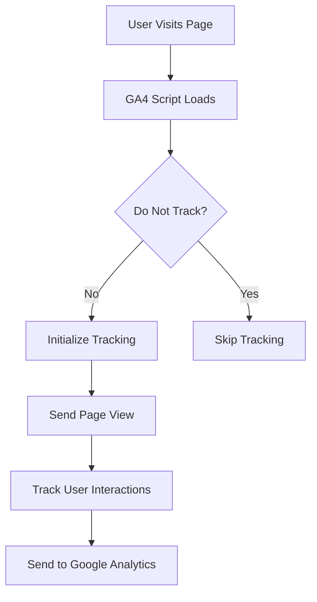
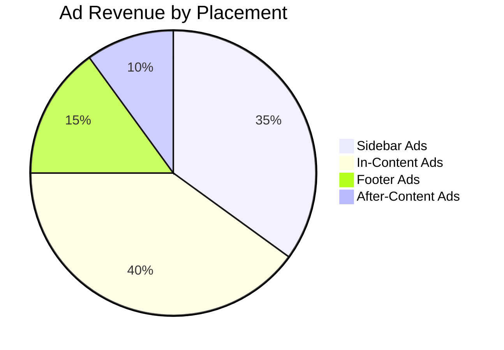
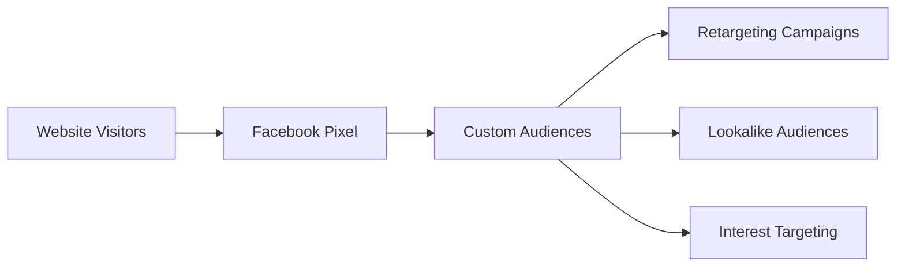
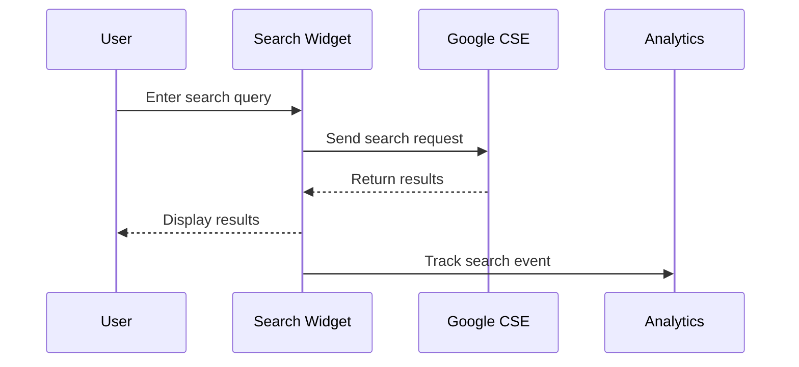
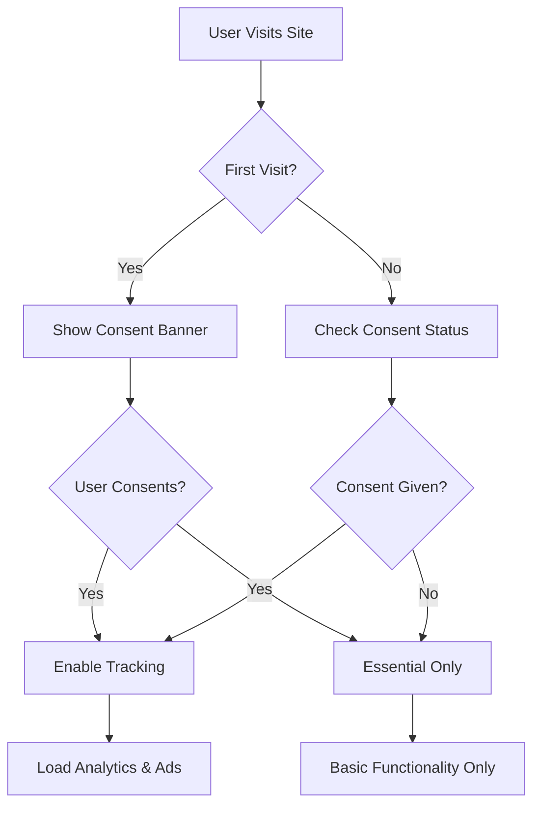
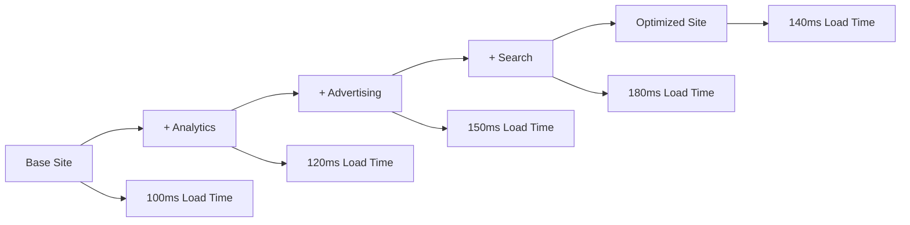

# Analytics and Advertising Integration Showcase

This post demonstrates the comprehensive analytics and advertising capabilities built into the Parsa Redesigned Hugo theme. Learn how to leverage Google Analytics 4, Google AdSense, and Facebook Pixel to understand your audience and monetize your content effectively.

## Google Analytics 4 Integration

The theme includes seamless Google Analytics 4 integration that respects user privacy while providing valuable insights.

### Key Features

- **Automatic Setup**: Simply add your GA4 Measurement ID to your Hugo configuration
- **Privacy Compliance**: Respects Do Not Track settings and includes IP anonymization
- **Performance Optimized**: Asynchronous loading prevents blocking page rendering
- **GDPR Ready**: Integrates with cookie consent management

### Configuration Example

```toml
# hugo.toml
GoogleAnalyticsID = "G-JKSVCT23D1"

[privacy.googleAnalytics]
  respectDoNotTrack = true
  anonymizeIP = true
```

### What Gets Tracked

With Google Analytics enabled, you'll automatically track:

- **Page Views**: Every page visit is recorded
- **User Sessions**: How long users spend on your site
- **Traffic Sources**: Where your visitors come from
- **Device Information**: Desktop vs mobile usage
- **Geographic Data**: Country and city-level location data
- **User Behavior**: Bounce rate, pages per session, and more

### Enhanced Tracking

The theme supports enhanced measurement features:



## Google AdSense Integration

Monetize your content with Google AdSense through intelligent ad placement and optimization.

### Smart Ad Placement

The theme provides multiple ad placement options:

- **Sidebar Ads**: Perfect for display advertisements
- **In-Content Ads**: Native ads within article content
- **Footer Ads**: Additional revenue opportunity
- **After-Content Ads**: Engage users after they finish reading

### Configuration Example

```toml
[params.adsense]
  enabled = true
  client = "ca-pub-2970874383549118"
  inArticleSlot = "4383549118"
  autoAds = false
  responsive = true
  lazyLoad = true
  
  [params.adsense.placements]
    sidebar = true
    footer = true
    inContent = true
    afterContent = true
    
  [params.adsense.slots]
    sidebar = "4383549119"
    footer = "4383549120"
    afterContent = "4383549121"
```

### Performance Optimization

The theme includes several AdSense optimizations:

1. **Lazy Loading**: Ads load only when they're about to be visible
2. **Responsive Units**: Ads automatically adapt to screen size
3. **Async Loading**: Ad scripts don't block page rendering
4. **Layout Stability**: Reserved space prevents layout shift

### Ad Performance Tracking

Monitor your ad performance with integrated tracking:



## Facebook Pixel Integration

Track conversions and build custom audiences with Facebook Pixel integration.

### Event Tracking

The theme automatically tracks important events:

- **Page Views**: Every page visit
- **Content Views**: When users read articles
- **Search Events**: When users search your site
- **Contact Events**: Form submissions and contact interactions

### Configuration Example

```toml
[params.facebookPixel]
  enabled = true
  pixelId = "123456789012345"
  advancedMatching = true
  
  [params.facebookPixel.events]
    pageView = true
    viewContent = true
    search = true
    contact = true
    lead = true
```

### Custom Audience Building

Use Facebook Pixel data to create custom audiences:



## Google Custom Search Integration

Enhance user experience with powerful search capabilities.

### Search Features

- **Autocomplete**: Suggestions as users type
- **Search History**: Remember recent searches
- **Fallback Support**: Local search when Google Custom Search is unavailable
- **Responsive Design**: Works perfectly on all devices

### Configuration Example

```toml
[params.gcs_engine_id]
  value = "3164aa570fbbb474a"

[params.googleCustomSearch]
  engineId = "3164aa570fbbb474a"
  enabled = true
  autoComplete = true
  enableHistory = true
  maxCompletions = 5
  fallbackToLocal = true
```

### Search Analytics

Track search behavior to understand user intent:



## Privacy and Consent Management

The theme includes comprehensive privacy features to ensure GDPR compliance.

### Cookie Consent Banner

Automatically manage user consent for tracking services:

```toml
[params.privacy.consentBanner]
  enabled = true
  message = "We use cookies to improve your experience and analyze site usage."
  acceptText = "Accept All"
  declineText = "Decline"
  learnMoreText = "Privacy Policy"
  learnMoreUrl = "/privacy-policy"
```

### Privacy Controls

Users can control their privacy preferences:

- **Do Not Track**: Automatically respected by all tracking services
- **Cookie Categories**: Granular control over different types of cookies
- **Opt-out Links**: Easy access to service-specific opt-out options

### Compliance Features



## Performance Optimization

The theme includes numerous performance optimizations to ensure fast loading times.

### Script Loading Strategy

1. **Critical Resources**: Loaded synchronously for essential functionality
2. **Analytics Scripts**: Loaded asynchronously to prevent blocking
3. **Ad Scripts**: Lazy loaded when ads are about to be visible
4. **Resource Hints**: Preconnect to external domains for faster loading

### Performance Monitoring

Track Core Web Vitals and performance metrics:

```toml
[params.performance]
  lazyLoadAds = true
  asyncScripts = true
  resourceHints = true
  
  preconnectDomains = [
    "https://www.googletagmanager.com",
    "https://pagead2.googlesyndication.com",
    "https://connect.facebook.net",
    "https://cse.google.com"
  ]
```

### Performance Impact

Monitor the impact of analytics and advertising on your site:



## Revenue Optimization

Maximize your revenue potential with strategic ad placement and tracking.

### A/B Testing

Test different ad configurations:

1. **Ad Placement**: Compare sidebar vs in-content performance
2. **Ad Sizes**: Test different ad unit sizes
3. **Ad Frequency**: Optimize the number of ads per page
4. **User Experience**: Balance revenue with user satisfaction

### Analytics-Driven Decisions

Use data to optimize your monetization strategy:

- **High-Performing Content**: Identify your most valuable pages
- **User Behavior**: Understand how users interact with ads
- **Conversion Tracking**: Measure the effectiveness of your content
- **Audience Insights**: Learn about your most valuable visitors

## Getting Started

### Step 1: Configure Analytics

1. Create a Google Analytics 4 property
2. Add your Measurement ID to your Hugo configuration
3. Enable privacy settings as needed

### Step 2: Set Up Advertising

1. Apply for Google AdSense (if not already approved)
2. Create ad units in your AdSense account
3. Configure ad placements in your Hugo configuration

### Step 3: Add Facebook Pixel

1. Create a Facebook Pixel in Facebook Business Manager
2. Add your Pixel ID to your Hugo configuration
3. Configure event tracking as needed

### Step 4: Enable Search

1. Create a Google Custom Search Engine
2. Add your Search Engine ID to your configuration
3. Customize search appearance and behavior

### Step 5: Configure Privacy

1. Enable cookie consent banner
2. Create privacy policy and cookie policy pages
3. Test privacy controls and opt-out functionality

## Best Practices

### Content Strategy

- **Quality First**: High-quality content attracts more valuable traffic
- **SEO Optimization**: Optimize for search engines to increase organic traffic
- **User Experience**: Balance monetization with user satisfaction
- **Mobile Optimization**: Ensure excellent mobile experience

### Technical Optimization

- **Page Speed**: Monitor and optimize loading times
- **Core Web Vitals**: Maintain good performance scores
- **Error Monitoring**: Track and fix technical issues quickly
- **Regular Updates**: Keep tracking codes and configurations current

### Privacy Compliance

- **Transparent Policies**: Clearly explain data collection practices
- **User Control**: Provide easy ways to manage privacy preferences
- **Legal Compliance**: Stay updated with privacy regulations
- **Regular Audits**: Review and update privacy practices regularly

## Conclusion

The Parsa Redesigned theme provides a comprehensive solution for website analytics and monetization. With built-in support for Google Analytics 4, Google AdSense, Facebook Pixel, and Google Custom Search, you can understand your audience, optimize your content, and generate revenue while maintaining user privacy and site performance.

The theme's privacy-first approach ensures GDPR compliance while still providing valuable insights and monetization opportunities. Performance optimizations ensure that adding these features doesn't compromise your site's speed or user experience.

Start with basic analytics, then gradually add advertising and advanced tracking features as your site grows. Always prioritize user experience and privacy compliance to build trust with your audience and create sustainable long-term success.