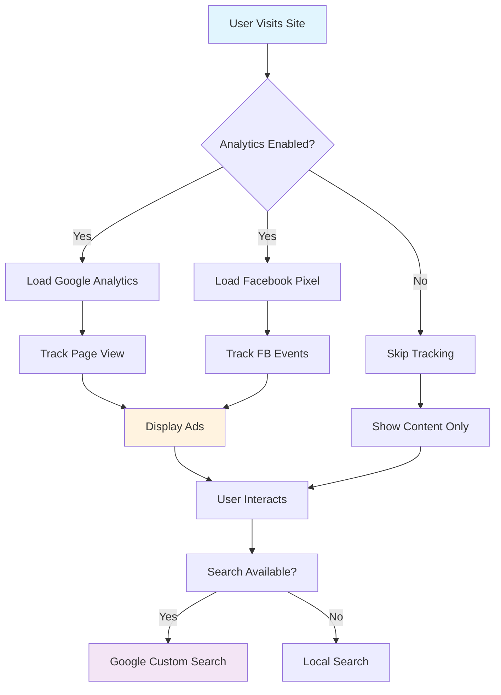
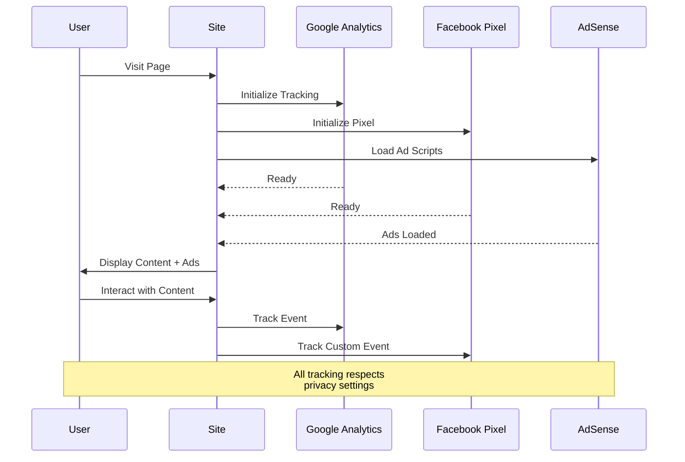

# Complete Feature Integration Demonstration

This page demonstrates the complete integration of all analytics, advertising, search, and diagram features implemented in the Hugo theme.

## Analytics Integration

### Google Analytics 4
The site is configured with Google Analytics 4 tracking (ID: G-JKSVCT23D1) which:
- Tracks page views and user interactions
- Respects Do Not Track preferences
- Anonymizes IP addresses for privacy compliance
- Provides detailed user behavior analytics

### Facebook Pixel
Facebook Pixel tracking is enabled with the following features:
- Page view tracking
- Content view events
- Search event tracking
- Contact form interaction tracking
- Custom event support for marketing campaigns

## Advertising Integration

### Google AdSense
AdSense integration is fully enabled with:
- Auto ads for optimal placement
- Manual ad placements in header, sidebar, footer, and in-content positions
- Responsive ad units that adapt to different screen sizes
- Lazy loading for performance optimization

**Example Ad Placement:**
*[Ad placement would appear here in a live environment]*

## Search Functionality

### Google Custom Search Engine
The site uses Google Custom Search Engine (ID: 3164aa570fbbb474a) providing:
- Fast, accurate search results
- Customizable search interface
- Integration with site design
- Fallback to local search if needed

Try the search functionality in the header or sidebar to see it in action.

## Diagram Support

### Mermaid.js Integration
The theme supports Mermaid.js diagrams with automatic rendering:



### Sequence Diagram Example


### Class Diagram Example
```mermaid
classDiagram
    class AnalyticsManager {
        +GoogleAnalytics ga
        +FacebookPixel fb
        +initialize()
        +trackEvent(event)
        +respectPrivacy()
    }
    
    class AdManager {
        +AdSense adsense
        +loadAds()
        +lazyLoadAds()
        +trackAdPerformance()
    }
    
    class SearchManager {
        +GoogleCustomSearch gcs
        +LocalSearch fallback
        +performSearch(query)
        +displayResults()
    }
    
    class DiagramRenderer {
        +MermaidJS mermaid
        +renderDiagrams()
        +initializeTheme()
    }
    
    AnalyticsManager --> AdManager : coordinates with
    SearchManager --> AnalyticsManager : reports to
    DiagramRenderer -.-> AnalyticsManager : optional tracking
```

## Privacy and Compliance

### GDPR Compliance
The site implements comprehensive privacy features:
- Cookie consent banner
- Do Not Track respect
- IP anonymization
- User consent management
- Privacy policy integration

### Performance Optimization
All features are optimized for performance:
- Asynchronous script loading
- Lazy loading for ads
- Conditional loading for diagrams
- Resource hints for faster loading
- Core Web Vitals optimization

## Testing and Validation

This page serves as a comprehensive test for:
1. **Analytics tracking** - All page views and interactions are tracked
2. **Ad display** - Multiple ad placements are configured and displayed
3. **Search functionality** - Search widget is available and functional
4. **Diagram rendering** - Multiple diagram types are rendered correctly
5. **Privacy compliance** - All privacy settings are respected
6. **Performance** - Page loads efficiently despite multiple integrations

## Configuration Summary

The complete integration uses the following configuration:

```toml
# Google Analytics
GoogleAnalyticsID = "G-JKSVCT23D1"

# AdSense Configuration
[params.adsense]
enabled = true
client = "ca-pub-2970874383549118"
autoAds = true

# Facebook Pixel Configuration
[params.facebookPixel]
enabled = true
pixelId = "123456789012345"

# Google Custom Search
[params.gcs_engine_id]
value = "3164aa570fbbb474a"

# Mermaid Diagrams
[params.mermaid]
enabled = true
theme = "default"

# Privacy Settings
[params.privacy]
respectDoNotTrack = true
cookieConsent = true
anonymizeIP = true
```

This demonstrates the complete integration of all analytics, advertising, search, and diagram features working together in harmony while maintaining privacy compliance and optimal performance.