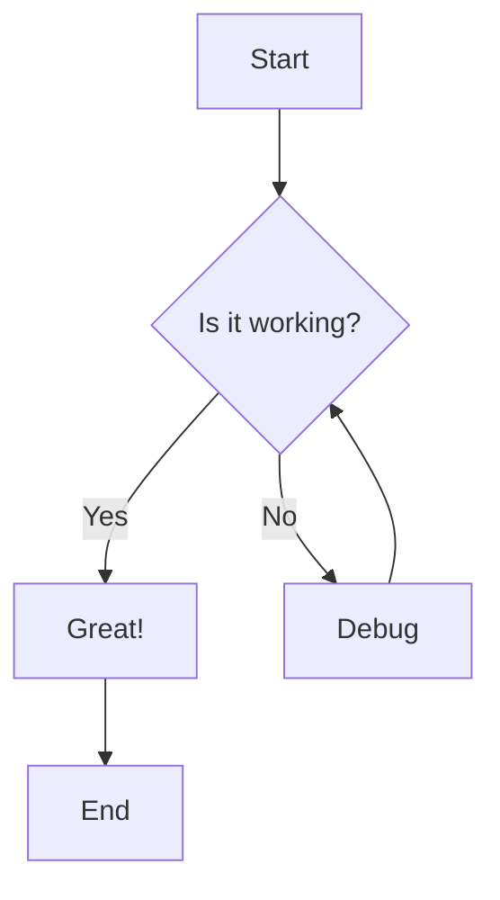
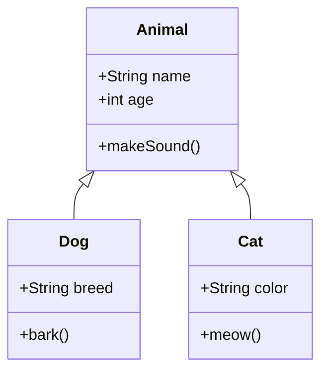

# Mermaid Diagrams Demo

This post demonstrates the Mermaid.js diagram support in the Hugo theme. You can create various types of diagrams using both code blocks and shortcodes.

## Flowchart using Code Block



## Sequence Diagram using Shortcode


sequenceDiagram
    participant Alice
    participant Bob
    participant John

    Alice->>Bob: Hello Bob, how are you?
    Bob-->>John: How about you John?
    Bob--x Alice: I am good thanks!
    Bob-x John: I am good thanks!
    Note right of John: Bob thinks a long<br/>long time, so long<br/>that the text does<br/>not fit on a row.

    Bob-->Alice: Checking with John...
    Alice->John: Yes... John, how are you?


## Class Diagram



## Gantt Chart


gantt
    title A Gantt Diagram
    dateFormat  YYYY-MM-DD
    section Section
    A task           :a1, 2024-01-01, 30d
    Another task     :after a1  , 20d
    section Another
    Task in sec      :2024-01-12  , 12d
    another task      : 24d


## Git Graph

```mermaid
gitgraph
    commit
    commit
    branch develop
    checkout develop
    commit
    commit
    checkout main
    merge develop
    commit
    commit
```

The Mermaid diagrams are automatically rendered when the page loads, and the library is only loaded when diagrams are present on the page for optimal performance.