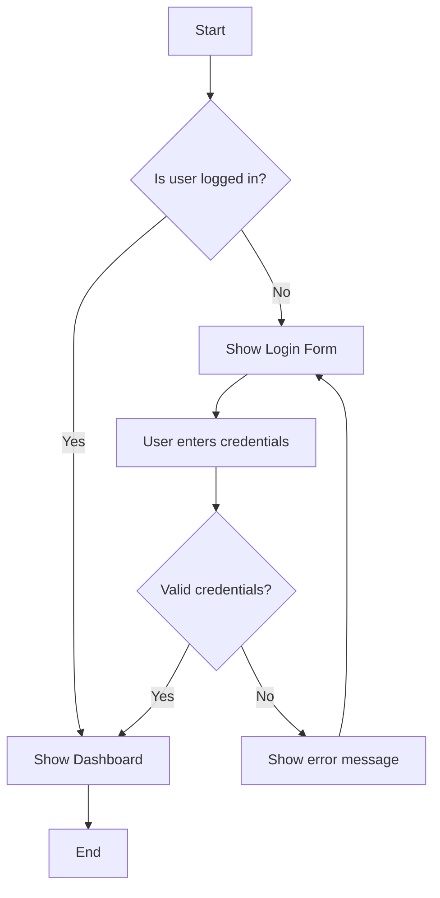
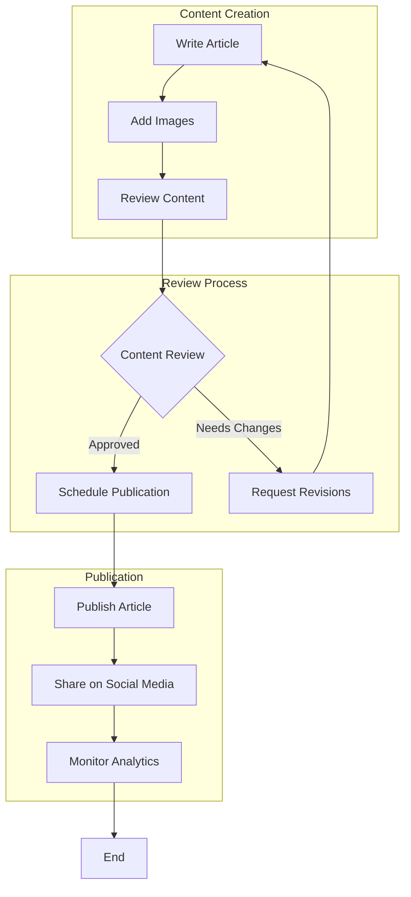
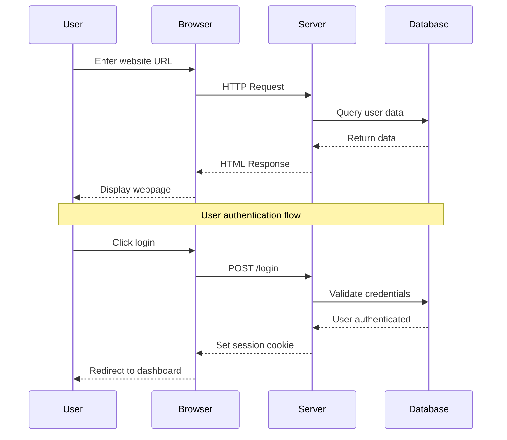
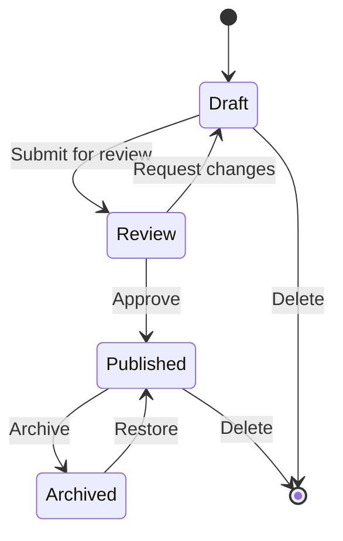
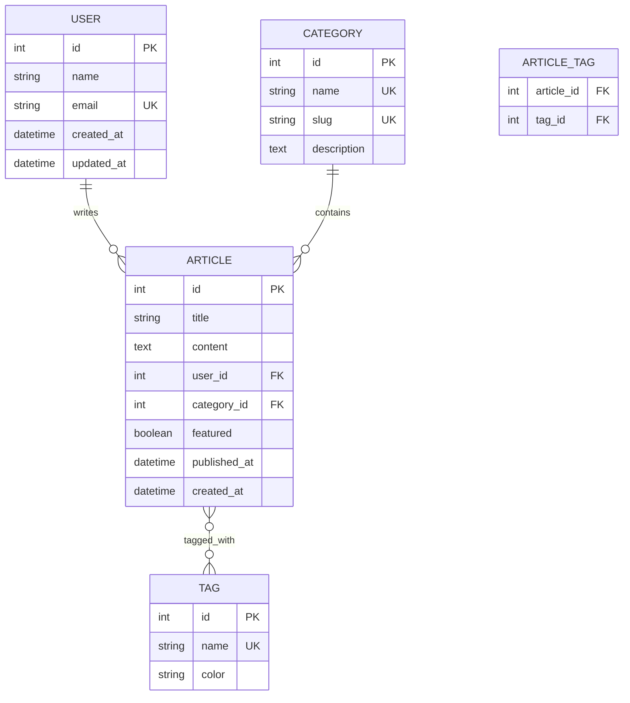
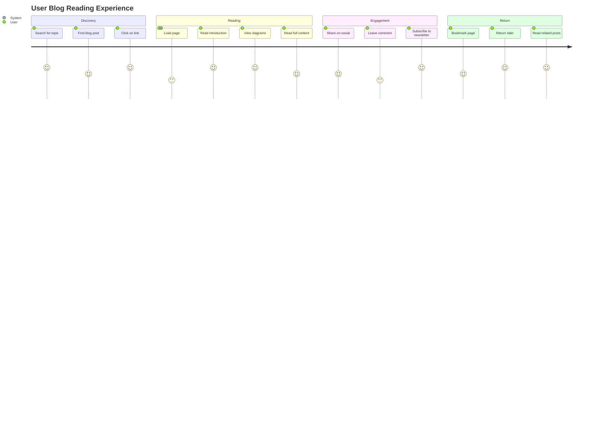
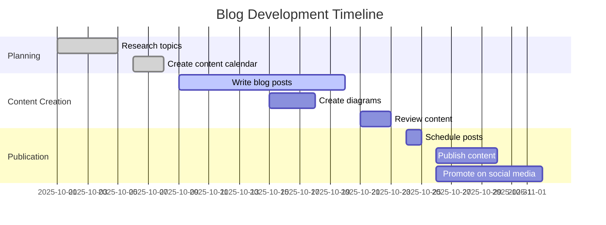
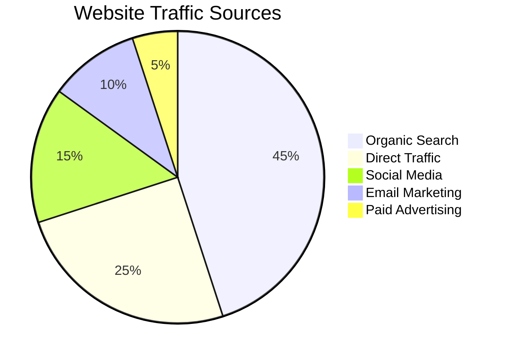

# Mermaid Diagrams Showcase

This post demonstrates the various types of diagrams you can create using Mermaid.js syntax in your Hugo content. The theme automatically detects Mermaid code blocks and renders them as interactive diagrams.

## Flowcharts

Flowcharts are perfect for showing processes, decision trees, and workflows.



### Complex Flowchart Example

Here's a more complex flowchart showing a content publishing workflow:



## Sequence Diagrams

Sequence diagrams show interactions between different entities over time.



## Class Diagrams

Class diagrams are useful for showing object-oriented relationships.

```mermaid
classDiagram
    class User {
        +String name
        +String email
        +Date createdAt
        +login()
        +logout()
        +updateProfile()
    }
    
    class Article {
        +String title
        +String content
        +Date publishedAt
        +Boolean featured
        +publish()
        +unpublish()
        +addTag()
    }
    
    class Category {
        +String name
        +String slug
        +String description
        +getArticles()
    }
    
    class Tag {
        +String name
        +String color
        +getArticles()
    }
    
    User ||--o{ Article : writes
    Article }o--|| Category : belongs to
    Article }o--o{ Tag : has many
```

## State Diagrams

State diagrams show the different states of a system and transitions between them.



## Entity Relationship Diagrams

ER diagrams show database relationships and structure.



## User Journey Diagrams

User journey diagrams map out user experiences and touchpoints.



## Gantt Charts

Gantt charts are perfect for project timelines and scheduling.



## Pie Charts

Pie charts are great for showing proportional data.



## Git Graphs

Git graphs show version control workflows and branching strategies.

```mermaid
gitgraph
    commit id: "Initial commit"
    commit id: "Add basic structure"
    branch feature/analytics
    checkout feature/analytics
    commit id: "Add Google Analytics"
    commit id: "Add Facebook Pixel"
    checkout main
    merge feature/analytics
    commit id: "Update documentation"
    branch feature/adsense
    checkout feature/adsense
    commit id: "Add AdSense integration"
    commit id: "Add ad placements"
    checkout main
    merge feature/adsense
    commit id: "Release v2.0"
```

## Using Mermaid Shortcodes

You can also use the Mermaid shortcode for more control:


mindmap
  root((Blog Theme))
    Analytics
      Google Analytics
      Facebook Pixel
      Custom Events
    Advertising
      Google AdSense
      Ad Placements
      Revenue Optimization
    Content
      Mermaid Diagrams
      Rich Shortcodes
      SEO Optimization
    Performance
      Lazy Loading
      Async Scripts
      Core Web Vitals


## Customizing Diagram Appearance

You can customize the appearance of your diagrams by configuring the Mermaid theme in your Hugo configuration:

```toml
[params.mermaid]
  enabled = true
  theme = "default"  # Options: default, dark, forest, neutral, base
  
[params.mermaid.flowchart]
  useMaxWidth = true
  htmlLabels = true
```

## Best Practices for Diagram Creation

1. **Keep it Simple**: Don't overcomplicate diagrams with too many elements
2. **Use Consistent Styling**: Stick to a consistent color scheme and layout
3. **Add Descriptive Labels**: Make sure all elements are clearly labeled
4. **Consider Mobile Users**: Ensure diagrams are readable on small screens
5. **Test Rendering**: Always preview your diagrams before publishing

## Accessibility Considerations

- Provide alternative text descriptions for complex diagrams
- Use sufficient color contrast in custom themes
- Consider providing tabular data as an alternative to visual diagrams
- Test with screen readers when possible

## Conclusion

Mermaid diagrams are a powerful way to enhance your content with visual elements. They're particularly useful for technical documentation, process explanations, and data visualization. The theme's automatic detection and rendering makes it easy to include diagrams in your Hugo content without any additional setup.

Try creating your own diagrams using the examples above as a starting point. The Mermaid syntax is intuitive and well-documented, making it easy to create professional-looking diagrams for your blog posts and documentation.