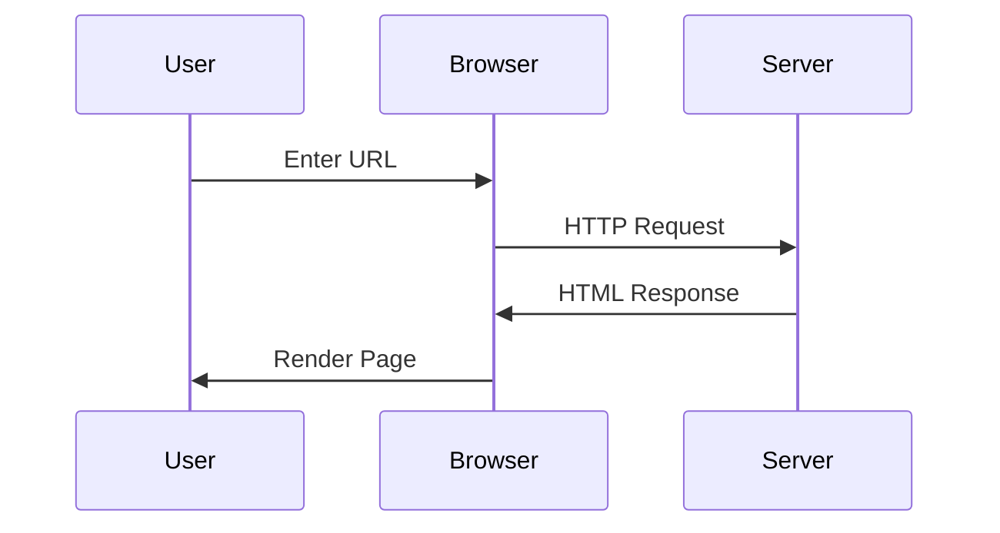

This page demonstrates all the enhanced Hugo shortcodes available in this theme, showcasing their privacy-focused features and consistent styling.

## Video Shortcodes

### YouTube Videos

The YouTube shortcode supports privacy-enhanced mode and various customization options:



You can also customize autoplay and start time:



### Vimeo Videos

Vimeo embeds with Do Not Track enabled by default:



## Social Media Shortcodes

### Twitter Posts

Twitter embeds respect privacy settings and can fall back to simple mode:



### Instagram Posts

Instagram posts with privacy-conscious embedding:



You can hide captions if needed:



## Code and Development

### GitHub Gists

Enhanced gist embedding with better error handling:



You can also specify a particular file from a multi-file gist:



## Enhanced Features

### Figure with Advanced Image Processing

The enhanced figure shortcode supports responsive images and WebP conversion:



### Alert Boxes

Create attention-grabbing alerts with different types:


This is an informational alert with useful tips and information.



This is a warning alert to draw attention to important information.



This is an error alert for critical information that needs immediate attention.



This is a success alert to confirm that an action was completed successfully.


### Mermaid Diagrams

Create beautiful diagrams using Mermaid syntax:


graph TD
    A[Start] --> B{Is it working?}
    B -->|Yes| C[Great!]
    B -->|No| D[Debug]
    D --> B
    C --> E[End]


You can also use code blocks with the `mermaid` language:



## Privacy and Performance Features

All shortcodes in this theme include:

- **Privacy Protection**: Respect Do Not Track settings and GDPR compliance
- **Performance Optimization**: Lazy loading and async script loading
- **Accessibility**: Proper ARIA labels and keyboard navigation
- **Responsive Design**: Mobile-friendly layouts and touch interactions
- **Error Handling**: Graceful fallbacks when external services are unavailable
- **Dark Mode Support**: Consistent styling across light and dark themes

## Configuration

You can control the behavior of these shortcodes through your Hugo configuration:

```toml
[privacy]
  [privacy.youtube]
    disable = false
    privacyEnhanced = true
  [privacy.twitter]
    disable = false
    enableDNT = true
    simple = false
  [privacy.instagram]
    disable = false
    simple = false
  [privacy.vimeo]
    disable = false
    enableDNT = true
```

When `simple = true` is set for social media shortcodes, they will display as simple links instead of full embeds, providing maximum privacy protection.